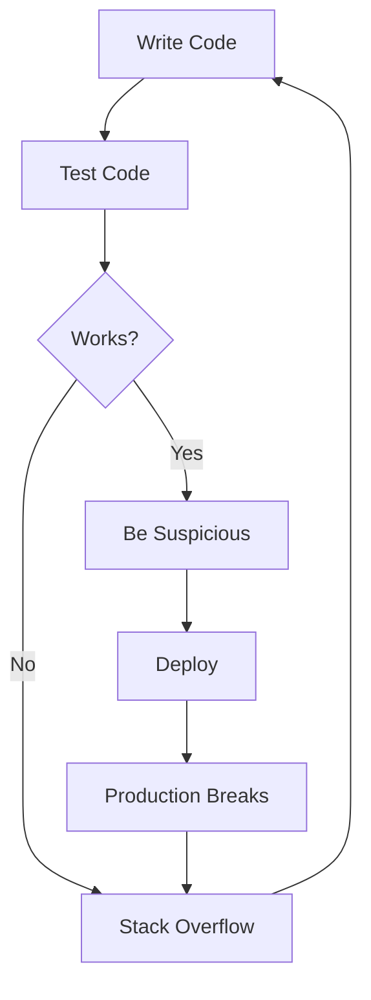
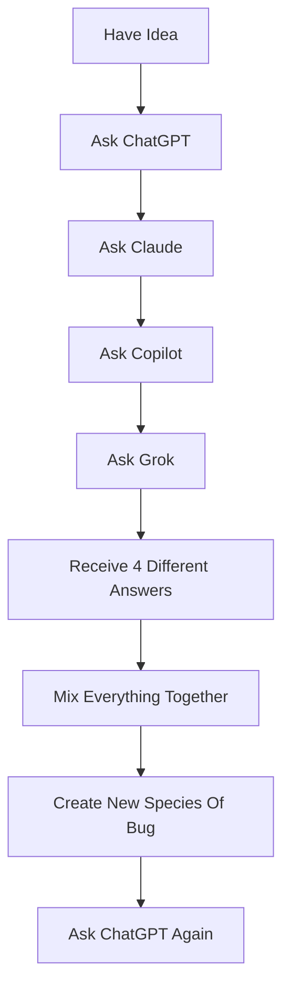

# 👋 Hey, I'm LzyAK

### Software Developer • AI Prompt Engineer 
> Professional bug creator. Part-time bug fixer.

---

Current status:

🟢 Online
🔴 Mentally debugging code I wrote 6 months ago

---

## 🚀 About Me

```javascript
const me = {
    name: Achuthan,
    role: Developer,
    coffeeLevel: Infinity,
    sleepSchedule: "undefined",
    currentlyDoing: "console.log('debugging')",
    actuallyDoing: "adding more console.log()"
    experience: "Enough to be dangerous"
    special_skill: Breaking things that worked yesterday
    weakness: Missing semicolons in languages that don't need semicolons
    power_level: Over 9000 warnings
    status: "Asking AI to explain AI-generated code"
};

```

* 💻 I turn caffeine into code.
* 🐛 I don't write bugs. I create unexpected features.
* 🔥 Works on my machine™
* 😴 Lazy enough to automate everything.
* 🚀 Smart enough to spend 6 hours automating a 5-minute task.

---

> I don't write all my code alone anymore.
> I have assembled an elite team of interns:
>
> 🤖 ChatGPT  : Creates prompts
> 🤖 Claude   : Rewrites ChatGPT prompts , Some times creates code 
> 🤖 Copilot  : Analyzes errors in github
> 🤖 Grok     : Adds chos
> 👨 Me       : Copies everything and says "Looks good" 
>
> Together, we create bugs at unprecedented speed.

---

🧠 Things I Believe
 * The code was working 5 minutes ago.
 * This bug wasn't here yesterday.
 * One more refactor won't hurt.
 * I'll document it later.
 * Future me is smarter than current me.

    Future me:
    
    WHO WROTE THIS??
    
    Me:
    
    git blame
    
    Also me:
    
    oh...

---

# 🏆 Achievements

✅ Fixed a bug by restarting VS Code

✅ Solved a problem after explaining it to a rubber duck

✅ Removed 500 lines of code and increased performance

✅ Added a new bug while fixing another bug

✅ Turned a 10-minute task into a 3-day project

---

## 🛠 Tech Stack

### Languages I Pretend To Know


---

## 📈 GitHub Stats

Because validation from strangers on the internet matters.

```text
Commits:       ████████████░░░░░░
Productivity:  ███░░░░░░░░░░░░░░░
Coffee:        ██████████████████
Motivation:    █░░░░░░░░░░░░░░░░░
```

---

## 🐛 My Development Workflow


### Second Flow




---

## 🤡 Daily Routine

```text
09:00  Wake up
09:30  Coffee
10:00  Open VS Code
10:05  Open YouTube
11:30  Back to VS Code
11:35  npm install
11:40  Something broke
13:00  Lunch
14:00  Fix bug
18:00  Realize bug was a typo
```

---

## 🔥 Fun Facts

* I have 99 problems and 127 of them are dependency issues.
* My code doesn't always work, but when it does, I'm scared to touch it.
* I use dark mode because light attracts bugs.
* If debugging is the process of removing bugs, then programming must be the process of putting them there.

---

🎲 Random Developer Quote

> "It's not a bug. It's an undocumented feature."

> "The best code is no code."

> "The second best code is code someone else wrote."

> "If debugging is removing bugs, programming is adding them."

---

## 📊 Skill Matrix

```text
| Skill                        | Level                 |
| ---------------------------- | --------------------- |
| Coding                       | ███████░░░░░░         |
| Debugging                    | ███████████░░         |
| Googling                     | █████████████         |
| Prompt Engineering           | ████████████████████  |
| Reading Documentation        | █░░░░░░░░░            |
| Convincing AI To Fix AI Code | █████████████         |
```

---

# ☕ Current Tech Stack

```yaml
Frontend:
  - javascript
  - jquery
  - Android

Backend:
  - java
  - spring

Database:
  - PostgreSQL
  - MongoDB

AI Infrastructure:
  - ChatGPT
  - Claude
  - Copilot
  - Grok

Human Infrastructure:
  - Coffee
  - Panic
  - Deadlines
```

---

## 🧠 Developer Wisdom

> "It compiled, therefore it shall ship."

> "Future me will fix it."

> "There's nothing more permanent than a temporary solution."

---

## 📫 Reach Me

```bash
$ ping your-name

Reply:
"Probably coding.
Maybe sleeping.
Definitely procrastinating."
```

---

### Thanks for visiting! 🎉

⭐ Feel free to stalk my repositories.

⚠️ Warning: Side effects of browsing my code may include confusion, laughter, and spontaneous debugging.
