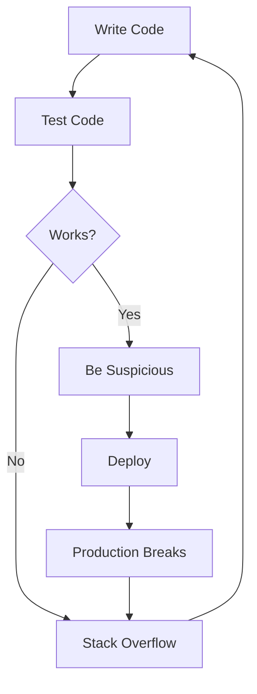

# 👋 Hey, I'm [Your Name]

> Professional bug creator. Part-time bug fixer.

---

## 🚀 About Me

```javascript
const me = {
    name: "Your Name",
    role: "Developer",
    coffeeLevel: Infinity,
    sleepSchedule: "undefined",
    currentlyDoing: "console.log('debugging')",
    actuallyDoing: "adding more console.log()"
};
```

* 💻 I turn caffeine into code.
* 🐛 I don't write bugs. I create unexpected features.
* 🔥 Works on my machine™
* 😴 Lazy enough to automate everything.
* 🚀 Smart enough to spend 6 hours automating a 5-minute task.

---

## 🛠 Tech Stack

### Languages I Pretend To Know


---

## 📈 GitHub Stats

Because validation from strangers on the internet matters.

```text
Commits:       ████████████░░░░░░
Productivity:  ███░░░░░░░░░░░░░░░
Coffee:        ██████████████████
Motivation:    █░░░░░░░░░░░░░░░░░
```

---

## 🐛 My Development Workflow



---

## 🤡 Daily Routine

```text
09:00  Wake up
09:30  Coffee
10:00  Open VS Code
10:05  Open YouTube
11:30  Back to VS Code
11:35  npm install
11:40  Something broke
13:00  Lunch
14:00  Fix bug
18:00  Realize bug was a typo
```

---

## 🔥 Fun Facts

* I have 99 problems and 127 of them are dependency issues.
* My code doesn't always work, but when it does, I'm scared to touch it.
* I use dark mode because light attracts bugs.
* If debugging is the process of removing bugs, then programming must be the process of putting them there.

---

## 📊 Current Status

```text
Coding        ███████░░░░░░ 40%
Debugging     ███████████░░ 80%
Googling      █████████████ 100%
Understanding Regex
█░░░░░░░░░░░░░░░░░░░░░░ 1%
```

---

## 🧠 Developer Wisdom

> "It compiled, therefore it shall ship."

> "Future me will fix it."

> "There's nothing more permanent than a temporary solution."

---

## 📫 Reach Me

```bash
$ ping your-name

Reply:
"Probably coding.
Maybe sleeping.
Definitely procrastinating."
```

---

### Thanks for visiting! 🎉

⭐ Feel free to stalk my repositories.

⚠️ Warning: Side effects of browsing my code may include confusion, laughter, and spontaneous debugging.
